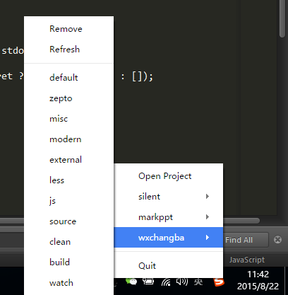

# gulp-app

Easily run [gulp](https://github.com/gulpjs/gulp) tasks from the tray menu and get notified when it's finished.

Forked from [sindresorhus/gulp-app](https://github.com/sindresorhus/gulp-app) to support **Windows** as well as **OSX**.

## License

MIT © [Sindre Sorhus](http://sindresorhus.com)
